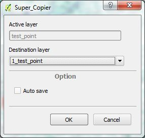
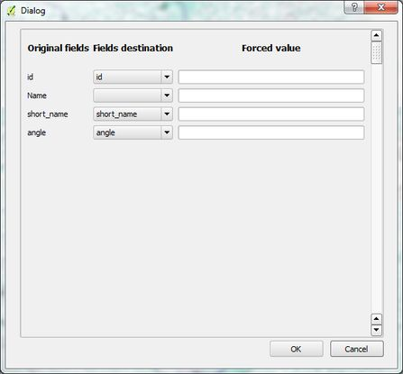

QGIS-Super\_Copier 
=================
Plugin QGIS pour choisir les champs lors de la copie de géométries.
La sélection des couches d'origine et de destination permet de rapprocher les champs communs.
Dans le cas contraire il y la possibilité de faire le lien entre 2 champs ou d'imposer une valeur.

Installation à partir dr github
-------------------------------

::
    cd .qgis2/python/plugins/
    git clone https://github.com/IDTruke/QGIS-Super_Copier

Utilisation du plugin
---------------------

* Vérifier que le plugin est activé dans le menu Extension
* Sélectionner la couche avec les objets à dupliquer
* Aller dans le menu -> Vecteur -> Super\_Copier -> Super\_Copier
* Sélectionner la couche de destination dans la première boite de dialogue

* Cocher l'option 'Enregistrement auto' si vous souhaitez que les modifications soitent directements appliquées
* Valider
* Vérifier le lien entre chaque champs dans la seconde boite de dialogue

* Si vous souhaitez forcer une valeur, remplir le champs 'Valeur forcée'
